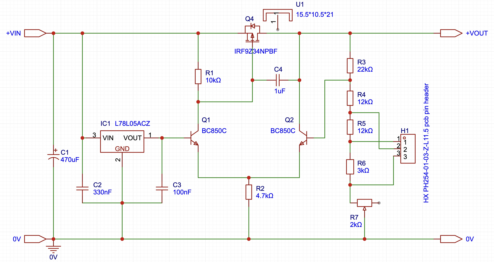

VLDO V1

BOM, Gerber and CPL avilable for download. SEE NOTES BELOW.

---

  

---

## Notes

Based on G4COL's schematic, with the following changes (final, V1.2 revision):
1- Additional input bypass capacitor.
2- Voltage selection ladder & trim potentiometer.
3- SMD components.

BOM, Gerber and CPL are shared on a **CC BY-NC-ND** basis. **Verify schematic before commiting to fabrication.**

[**Download here:**](downloads/bom-gerber)

Additional materials required:
1x 2.54mm shunt.
1x M3 machine screw.
Optional (but advised): TO-220 isolation washer and thermal pad.
