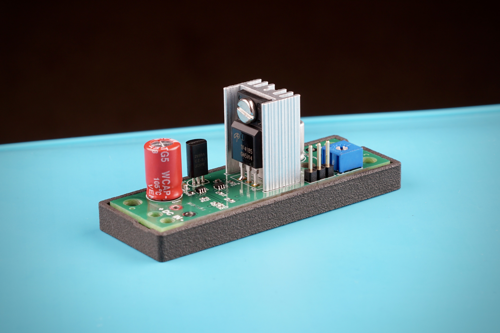

# M9OMS VLDO V2

A discrete **very low dropout (VLDO)** linear voltage regulator designed for low-noise RF applications. The regulator accepts an input of 8–18 VDC and provides a selectable **9.0 V / 12.0 V / 13.8 V** output at up to **2 A** continuous, making it suitable for portable and fixed QRP radio equipment such as the QRP Labs QMX.

**Product page:** [M9OMS VLDO V2 — RF-quiet power supply for QRP Labs QMX](index.md)

---

  

---

## Overview

Portable amateur radio equipment often operates from batteries whose voltage varies significantly during discharge. Commercial LDO boards can require several hundred millivolts of headroom, while switching converters may introduce unwanted RF noise, and some exhibit poorly characterised transient behaviour. The M9OMS VLDO V2 was developed to provide a clean, stable linear supply capable of operating with exceptionally low dropout while maintaining high output current and fast transient response. The design is intended for applications where supply integrity is more important than absolute conversion efficiency.

**Key features:**

* 8.0–18.0 V input operating range
* Selectable 9.0 V, 12.0 V or 13.8 V output
* Up to 2 A continuous output current
* Less than 100 mV dropout (measured at 1 A)
* Fast transient response
* Low-noise linear topology suitable for RF applications

---

## Design Background

The project originated as a regulator for the QRP Labs QMX, which originally specified a maximum supply voltage of 12.0 V. Exceeding this limit risked damage, yet each of the obvious power options involved compromise:

* **Switching converters** provide excellent efficiency but may introduce RF noise, and their transient and startup behaviour is often undocumented. Visually identical modules can differ by batch, source, or undocumented design changes.
* **USB-C PD triggers** are still switching converters, so the same noise and startup risks apply. Actual output can exceed 12.0 V depending on the source, and PD supplies are better suited to steady charging loads than to the rapidly changing demands of SSB or CW operation.
* **Series rectifier diodes** provide simple, inexpensive over-voltage protection, but they waste power and reduce usable battery capacity across most of the discharge curve.
* **Partially charged batteries** avoid additional circuitry entirely, but require active monitoring and are not universally applicable.
* **Commercial LDO boards** frequently require more dropout voltage than is desirable when operating from a nominal 12 V battery system, and again their transient and startup behaviour is often undocumented.

The objective therefore became the development of a single regulator combining wide input range, low dropout, low output noise and sufficient current capability for typical QRP transceivers.

### Design Lineage

This project follows the evolution of a discrete topology:

1. **SPRAT Issue 201 (G4COL):** [Ian Braithwaite's original schematic.](https://www.gqrp.com/limiter.jpg)
2. **M9OMS VLDO Prototype:** A 4-layer PCB implementation of G4COL's topology, miniaturised with targeted component upgrades. [DC performance independently measured by KC7XE.](https://groups.io/g/QRPLabs/message/158202)
3. [**M9OMS VLDO V1.1:**](https://www.ebay.com/itm/267709138260) Based on the prototype, with an output-selection ladder and trim, mounting holes and cable strain relief.
4. [**M9OMS VLDO V2:**](https://www.ebay.com/itm/267709192002) A fresh design to reduce dropout, improve transient response and improve in-dropout performance beyond V1.1. A clearance hole has been added for case mounting in applications requiring higher dissipation. See [DC improvements vs V1.1](improvements.html).

---

## Electrical Specifications

| Parameter | Specification | Conditions / Notes |
| :--- | :--- | :--- |
| Input Voltage Range | 8.0 V to 18.0 V DC | Continuous operating range |
| Output Voltage | 9.0 V / 12.0 V / 13.8 V | Selected by header pins; fine adjustment via R7 |
| Maximum Output Current | 2.0 A | Continuous operation |
| Dropout Voltage | <100 mV | At ILOAD = 1.0 A, regulation threshold |
| Quiescent Current (IQ) | Typical 6 mA | Over VIN = 8.0–18.0 V, no load |
| Load Regulation | 20 mV (typ.) | Output change from 0.1 A to 1.0 A |
| | 40 mV (typ.) | Output change from 0.1 A to 2.0 A |
| Line Regulation | ~8 mV/V | 100 mA and 1.0 A, regulation onset → max VIN, worst case (12 V setting) |
| Output Ripple Voltage | ~2 mV p-p | Low-noise DC input, 0–1.5 A load, measured at output terminals |
| Load-Step Overshoot / Undershoot | No measurable overshoot or undershoot observed | 0.1 A ↔ 1.5 A load step, VOUT = 12.0 V |
| Load-Step Settling Time | 25 µs (typ.) | Load applied (0.1 A → 1.5 A), settling to within load regulation band |
| | 40 µs (typ.) | Load released (1.5 A → 0.1 A), settling to within load regulation band |
| Measurement Notes | — | Transient response measured at output terminals through test leads. Load-step edge rate not characterised; values are representative measurements. |

Unless otherwise noted, measured values were obtained on production-representative hardware. The full dataset and test conditions are in:
- [DC Bench Measurements](measurements.html).
- [Oscilloscope Measurements](transient.html).

---

## Architecture: V2 vs V1.1

VLDO V2 represents a substantial redesign rather than an incremental PCB revision.

### 1. Pass Device (IRF9Z34N → AOTF4185)

Near dropout, regulator performance is governed primarily by pass-device transconductance rather than static RDS(on). The AOTF4185 delivers 2.0 A at lower gate drive than the IRF9Z34N, providing improved headroom at higher output currents. Its isolated TO-220F package also simplifies heatsink installation.

### 2. Active Gate Drive

In V1.1, the differential pair drove the pass-FET gate through a passive 10 kΩ pull-up, which limited gate-charge speed. V2 adds a complementary emitter-follower stage (Q3/Q4), reducing gate-drive impedance from approximately 10 kΩ to only a few tens of ohms and significantly improving large-signal transient response.

### 3. Pole-Splitting Compensation

The compensation network has been redesigned using pole splitting with a reduced Miller capacitor (C3) and a feed-forward capacitor (Cff) to add phase boost near crossover. This increases loop bandwidth while maintaining stable operation.

### 4. Symmetrical Differential Pair Loading

V1.1 loaded only one side of the long-tailed pair, resulting in a collector-current mismatch. V2 uses matched collector loading on both halves (R1 = Rdu1), improving operating symmetry and reducing input-referred noise.

### 5. Damped Output Network

V1.1 had no output bulk capacitor or snubber, so fast load changes could appear directly at the output. V2 adds a polymer bulk capacitor together with a damped ceramic snubber, improving output stability during rapid load transitions.

---

## Performance Summary

[Compared with Version 1.1](improvements.html), Version 2 demonstrates:

* Reduced dropout voltage under load
* Improved regulation near dropout
* Significantly faster transient response
* Improved large-signal gate drive
* Increased expected loop bandwidth

Simulation also predicts improved PSRR and loop stability, pending experimental verification.

---

## Validation Status

The majority of static electrical performance has now been verified on production-representative hardware. Completed measurements include input/output regulation, dropout voltage, load regulation, line regulation, thermal performance, and output characteristics across the full operating range.

Dynamic measurements currently in progress include phase margin, gain margin, unity-gain bandwidth, PSRR verification, and broadband noise characterisation.

Static DC measurement data has been independently reproduced across multiple boards, providing confidence that the observed performance is representative of the design rather than a single prototype.

---

## Future Development

Future revisions will focus primarily on refinement rather than architectural change. Planned work for V2.1 includes:

* Evaluation of lower quiescent-current voltage references
* Further optimisation of PCB thermal symmetry
* Polymer input capacitor validation
* Simplified output-voltage selection header
* Completion of dynamic performance characterisation

A hybrid switch-mode/linear regulator intended for higher-power applications is also under consideration once Version 2 characterisation is complete.

---

## Acknowledgements

Independent measurement and validation by KC7XE and CR7BTQ have been invaluable in verifying the performance of the production hardware.
