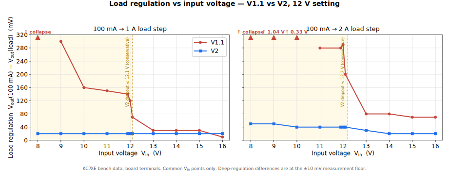
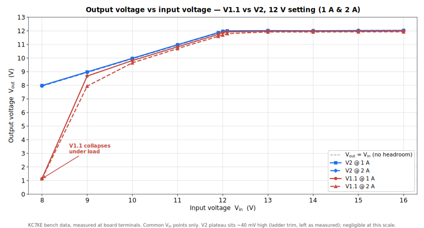
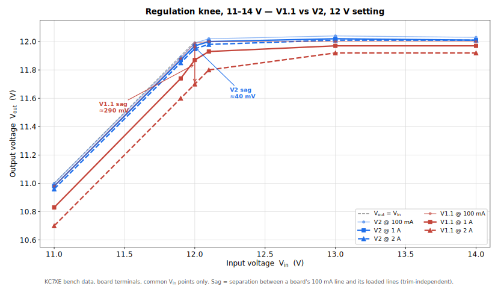

# M9OMS VLDO V1.1 vs V2 — Low-Dropout (LDO) Regulator Bench Comparison

A like-for-like bench comparison of the **M9OMS VLDO V1.1** and **V2** boards at the 12 V output
setting. Both datasets are [KC7XE bench measurements](measurements.md); this page uses the input voltages common to both runs. Each comparison is direct.

> V2 is work in progress. The figures below are DC measurements on single samples of each board,
> taken at the board terminals. The dynamic measurements (transient response, loop characterisation,
> PSRR) listed under [Validation Status](README.md#validation-status) are not addressed
> here.

---

## Scope and method

- **Output setting.** Only the **12 V setting** is compared — which the V1.1 dataset covers.
  The 9 V and 13.8 V settings have no V1.1 data for comparison.
- **Measurement point.** All values are taken at the **board terminals**, with the supply raised
  under load to hold Vin, following the method in
  [Bench Measurements](measurements.md#test-method-and-conditions). This removes lead-resistance
  drop, so the figures reflect the regulators rather than the wiring.
- **Input range.** Common Vin points only, data only collected upto 16 V.
- **Metric.** Load regulation, ΔVOUT = Vout(100 mA) − Vout(load), at 1 A and 2 A. For a QMX this corresponds to the receive-to-transmit step (≈100 mA to ≈1 A); the 2 A column covers higher-power use and margin.

Lower values indicate tighter regulation.

---

## Results

ΔVOUT (mV) at each common input voltage, 12 V setting:

| Vin (V) | V1.1, 100 mA→1 A | V2, 100 mA→1 A | V1.1, 100 mA→2 A | V2, 100 mA→2 A |
| ---: | ---: | ---: | ---: | ---: |
| 8.0 | collapse † | 20 | collapse † | 50 |
| 9.0 | 300 | 20 | 1040 | 50 |
| 10.0 | 160 | 20 | 330 | 40 |
| 11.0 | 150 | 20 | 280 | 40 |
| 11.9 | 140 | 20 | 280 | 40 |
| 12.0 | 120 | 20 | 290 | 40 |
| 12.1 | 70 | 20 | 200 | 40 |
| 13.0 | 30 | 20 | 80 | 30 |
| 14.0 | 30 | 20 | 80 | 20 |
| 15.0 | 30 | 20 | 70 | 20 |
| 16.0 | 10 | 20 | 70 | 20 |

† At 8.0 V, V1.1 output collapses under load (Vout 1.1 V at both 1 A and 2 A); V2 maintains regulation at 8 V.

Two points on reading the table:

- **In regulation (≈13–16 V), the 1 A figures are within the measurement floor.** The two boards
  differ by no more than ±10 mV, and the single value favouring V1.1 at 16 V (10 vs 20 mV) sits at
  that resolution; it should not be read as a difference. The 1 A advantage appears only as
  Vin approaches the setpoint.
- **At 2 A the difference is clear of the measurement floor across the range** — approximately
  2–3× lower ΔVOUT in regulation, improving further in the dropout region.

---

## ΔVOUT vs input voltage

  

<em>ΔVOUT, 12 V setting. The shaded band marks V2's conservative
dropout estimate (Vin ≤ 12.1 V at 1 A, ≤ 12.2 V at 2 A); the V1.1 dropout boundary has not
been characterised. V1.1 markers above the scale are off-chart; "collapse" indicates loss of
regulation at that load.</em>

V2 maintains a near-constant ΔVOUT across the voltage range — approximately 20 mV at 1 A and 40 mV at 2 A. V1.1 is comparable only above the setpoint, rapidly degrading as Vin falls, this is the range a battery occupies as it discharges.

---

## Mechanism: output voltage vs input voltage

  

<em>Output voltage versus input voltage, 12 V setting. V2 tracks the no-headroom
line down to 8 V under load; V1.1 departs below ~9 V, collapsing at 8 V.</em>

The ΔVOUT figures arise from two differences, both visible in the graphs.

**Dropout-region behaviour.** Below the 12 V setpoint a linear regulator can only pass
Vin less its own dropout. V2's lower dropout allows it to deliver close to the full input
voltage at 1–2 A down to 8 V. V1.1 requires more headroom: under load its output departs from the
input at around 11–12 V, deteriorating as it approaches by 8 V. For a 3S LiPo under transmit load, this
determines how far down the discharge curve the supply remains usable.

**Pass-device conduction at higher current.** At 2 A the V2 pass device drops less and is driven
harder, so its 2 A ΔVOUT (~40 mV) remains close to its 1 A ΔVOUT (~20 mV). V1.1's 2 A ΔVOUT is 2–3× the 1 A figure in regulation, increasing further in the dropout region as gate drive becomes insufficient — the same mechanism behind the loss of regulation at 8 V.

### Regulation knee (11–14 V)

  

<em>Regulation knee, 11–14 V. Each board's 100 mA, 1 A and 2 A traces are shown;
ΔVOUT is the vertical separation between a board's light-load trace and its loaded traces, 
independent of trim.</em>

Plotting all three load traces shows the behaviour in detail. V2's 100 mA, 1 A and 2 A traces remain
within approximately 40 mV of one another up to and through the knee, reaching the plateau by
~12.1 V. V1.1's traces separate below ~12 V — at 12.0 V the 2 A output has fallen approximately
290 mV below the 100 mA trace — and the board does not fully settle until ~13 V. **A 12 V output taken
from a nominal 12 V battery operates within this window.**

---

## Summary

- **In regulation:** the two boards are comparable at 1 A; V2 shows approximately 2–3× lower ΔVOUT at
  2 A.
- **Approaching and below the setpoint:** V2 maintains near-constant ΔVOUT (~20 mV at 1 A, ~40 mV at
  2 A), while V1.1 degrades to several hundred millivolts and then loses regulation. This is the range
  relevant to battery operation.
- **At 8 V, 1–2 A:** V2 maintains output; V1.1 does not.

For the full V2 dataset (all three output settings, thermal, drift) see
[Bench Measurements](measurements.md); for the design rationale and the V1.1 → V2 change list see the
[project README](README.md).

---

*Comparison data: **Stan Dye, KC7XE**. V1.1 and V2 measured by the same method, at the board
terminals, single sample of each board. Plots generated from the tabulated data above.*

