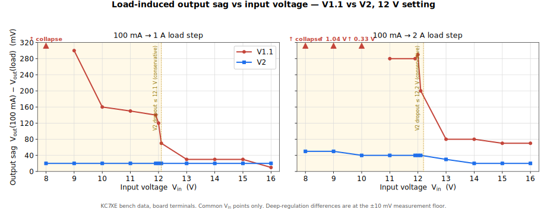

# VLDO V1.1 → V2 — Measured Improvements

A like-for-like bench comparison of the **M9OMS VLDO V1.1** and **V2** boards, showing
where the V2 redesign actually pays off. Both datasets are
[KC7XE bench measurements](measurements.md); this page only uses points that exist in
*both* runs, with no interpolation or extrapolation, so every comparison is direct.

> **Proof-of-concept status.** V2 is still work in progress. The figures below are DC
> measurements on single samples of each board; the dynamic work (transient, loop
> characterisation, PSRR) listed under
> [Outstanding Bench Work](README.md#outstanding-bench-work) is not covered here.

---

## Scope and method

- **One setting compared.** Only the **12 V setting** is shown — that is the setting the
  V1.1 dataset covers. The 9 V and 13.8 V settings have no V1.1 counterpart to compare against.
- **Measured at the board terminals**, supply raised under load to hold Vin, exactly
  as described in [Bench Measurements](measurements.md#test-method-and-conditions). This removes
  lead-resistance drop, so the numbers reflect the regulators, not the wiring.
- **Common Vin points only**, bounded to the **8–18 V** rating. Both tables extend to
  16 V at this setting, so the plots span 8–16 V.
- **Metric: load-induced output sag** = Vout(100 mA) − Vout(load), measured
  at 1 A and 2 A. Subtracting two readings *on the same board* cancels each board's reference-trim
  offset (V2 happens to sit ~40 mV high at this setting), so the comparison is clean without any
  normalisation fudge. For a QMX this is literally the **receive → transmit** step (≈100 mA → ≈1 A);
  the 2 A column covers higher-power use and margin.

Lower sag is better.

---

## The numbers

Output sag (mV) at each common input voltage, 12 V setting:

| Vin (V) | V1.1 — 100 mA→1 A | **V2 — 100 mA→1 A** | V1.1 — 100 mA→2 A | **V2 — 100 mA→2 A** |
| ---: | ---: | ---: | ---: | ---: |
| 8.0 | collapse † | **20** | collapse † | **50** |
| 9.0 | 300 | **20** | 1040 | **50** |
| 10.0 | 160 | **20** | 330 | **40** |
| 11.0 | 150 | **20** | 280 | **40** |
| 11.9 | 140 | **20** | 280 | **40** |
| 12.0 | 120 | **20** | 290 | **40** |
| 12.1 | 70 | **20** | 200 | **40** |
| 13.0 | 30 | **20** | 80 | **30** |
| 14.0 | 30 | **20** | 80 | **20** |
| 15.0 | 30 | **20** | 70 | **20** |
| 16.0 | 10 | **20** | 70 | **20** |

† At 8 V the V1.1 output collapses under load (≈1.1 V at both 1 A and 2 A) — it cannot supply
the current at this input. V2 delivers it at ≈8.0 V.

Two honest caveats so the table isn't over-read:

- **Deep in regulation (≈13–16 V), the 1 A difference is a wash.** Both boards sit within the
  ±10 mV measurement floor; the lone "V1.1 better" cell at 16 V (10 vs 20 mV) is one LSB of noise,
  not a result. The 1 A advantage is real only as Vin approaches the setpoint.
- **The 2 A column is the decisive one** — V2 is clear of the noise floor everywhere, roughly
  2–3× better deep in regulation and 5–25× better through the dropout region.

---

## Output sag vs input voltage

  

<em>Load-induced output sag, 12 V setting. Shaded band is the dropout region
(Vin below the 12 V setpoint). V1.1 markers above the scale are off-chart; "collapse"
means the board stopped regulating at that load.</em>

V2 holds a near-flat sag across the whole rated band — about **20 mV at 1 A** and **40 mV at 2 A**,
right down to the setpoint. V1.1 is comparable only well *above* the setpoint and degrades steadily
as Vin falls, exactly where a battery spends its discharge.

---

## Why — output voltage vs input voltage

The sag numbers come from two physical differences, both visible in the raw output-vs-input curves:

  

<em>Output vs input, 12 V setting. V2 tracks the dashed no-headroom line down to 8 V
under load; V1.1 falls away below ~9 V and collapses at 8 V.</em>

**1. The dropout region is a battery win.** Below the 12 V setpoint a linear regulator can only
pass Vin minus its own dropout. V2's much lower dropout lets it keep delivering almost
the full input voltage at 1–2 A all the way down to 8 V. V1.1 needs far more headroom: under load
its output peels away from the input around 11–12 V and has collapsed by 8 V. For a 3S LiPo sagging
under transmit, that is the difference between using the bottom of the pack and dropping out early.

**2. Lower RDS(on) / stronger gate drive is a high-current win.** At 2 A the V2 pass
device drops far less and is driven harder, so its 2 A sag (~40 mV) stays close to its 1 A sag
(~20 mV). V1.1's 2 A sag runs 2–3× its 1 A figure even in regulation, and balloons in the dropout
region as the pass device runs short of gate drive — the same effect that ends in collapse at 8 V.

### Zoomed to the knee (11–14 V)

  

<em>Regulation knee, 11–14 V. Each board's 100 mA, 1 A and 2 A traces are shown; the
sag is the vertical gap between a board's light-load line and its loaded lines, so the comparison
is independent of each board's trim.</em>

Plotting all three load traces makes the difference plain. V2's 100 mA, 1 A and 2 A lines stay
**glued together** (≈40 mV spread) right up to and through the knee, reaching their plateau by
~12.1 V. V1.1's three lines **fan apart** below ~12 V — at 11.9 V the 2 A output has already sagged
~280 mV below the 100 mA line — and the board doesn't fully settle until ~13 V. A 12 V-out
application running from a ~12 V battery sits squarely in this window: V2 holds, V1.1 droops.

---

## Takeaways

- **In regulation:** V2 and V1.1 are close at 1 A; V2 is ~2–3× tighter at 2 A.
- **Approaching and below the setpoint:** V2 is dramatically better — flat ~20/40 mV sag where
  V1.1 runs to hundreds of mV and then collapses. This is the region that matters for battery
  operation.
- **At 8 V, 1–2 A:** V2 works; V1.1 does not.

For the full V2 dataset (all three output settings, thermal, drift) see
[Bench Measurements](measurements.md); for the design rationale and the V1.1 → V2 change list see
the [project README](README.md).

---

*Comparison data: **Stan Dye, KC7XE**. V1.1 and V2 measured by the same method, at the board
terminals, single sample of each board. Plots generated from the tabulated data above.*
