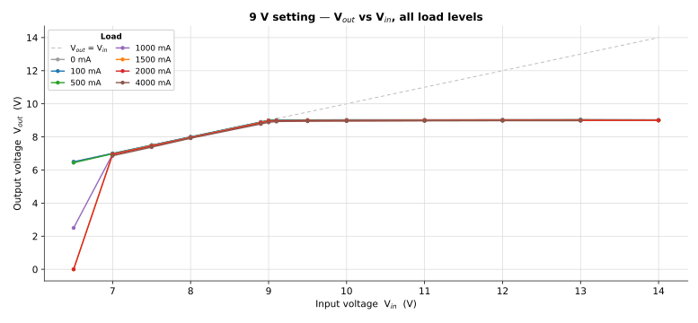
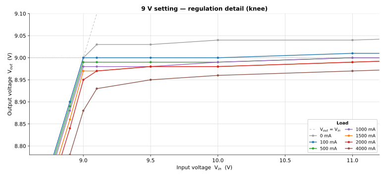
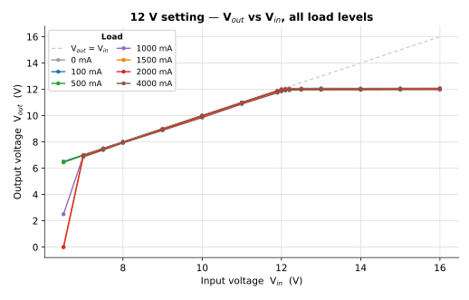
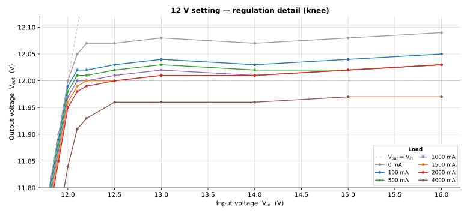
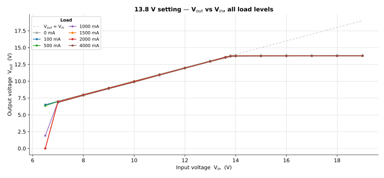
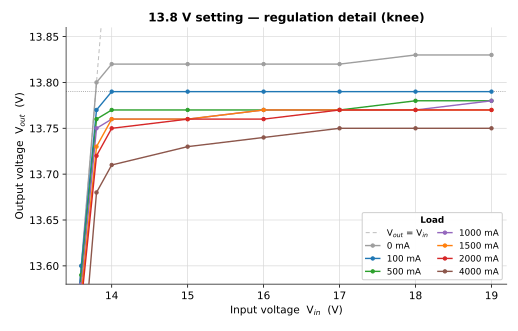
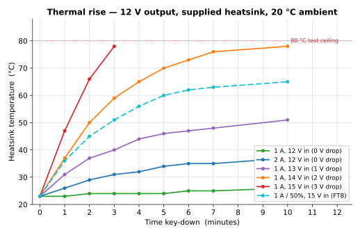
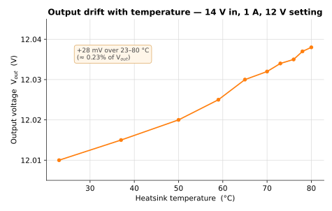

# VLDO V2 — Bench Measurements

Measured DC and thermal performance of the **M9OMS VLDO V2** regulator. This page
records hardware results that supplement — and progressively replace — the
simulation figures in the [main specification table](./README.md#technical-electrical-specifications).

> **Measurements by Stan Dye, KC7XE** (June 2026), on a single production-representative
> V2 board supplied by M9OMS. Method follows Stan's earlier characterisation of the
> M9OMS prototype, [shared on the QRP Labs group](https://groups.io/g/QRPLabs/message/158202).

---

## Test method and conditions

- **All voltages measured at the VLDO board terminals.** The supply was raised as load
  increased to hold Vin at the stated value, removing lead-resistance drop from
  the results. Repeating these sweeps without compensating for supply-lead drop will give
  lower apparent Vout at high current.
- **Single sample.** Figures are from one board and have not yet been characterised across
  units or temperature-cycled; treat them as representative rather than guaranteed limits.
- **Load range.** Sweeps cover 0–4 A. The 2 A column is the rated continuous maximum; the
  4 A column is included for reference only (beyond rating).
- **Application focus.** Emphasis is on QMX / QMX+ use — roughly 100 mA receive and ~1 A
  transmit — so thermal testing concentrates on that range.
- **Thermal setup.** 20 °C ambient, still air, supplied heatsink only, board open on the
  bench (no enclosure). Thermocouple fixed between the heatsink fins.

## Output-voltage setup

The jumper selects one of three nominal outputs, fine-trimmed with `R7`. The trimmer was
set once for **9.00 V at 100 mA**; the other two settings were then left untouched, which
landed them close enough that no per-setting re-trim was needed:

| Jumper setting | Output at 100 mA |
| :--- | :--- |
| 9 V | 9.00 V *(trimmed reference)* |
| 12 V | 12.04 V |
| 13.8 V | 13.79 V |

---

## DC performance at a glance

| Parameter | Measured | Condition | Simulated spec |
| :--- | :--- | :--- | :--- |
| **Dropout** | ~20–30 mV | 1 A, at board terminals | < 100 mV @ 1 A |
| **Dropout** | ~50 mV | 2 A | ~200 mV @ 2 A (est.) |
| **Load regulation** | ~20 mV / ~30 mV | 0.1→1 A / 0.1→2 A, in regulation | ~20 mV / ~40 mV |
| **Line regulation** | ≤ ~3 mV | regulation onset → max Vin, 1 A | < 5 mV |
| **Minimum input** | usable to 7 V | rises with load below ~7 V *(see note)* | 8 V (continuous) |
| **No-load float** | +30–40 mV | output open vs. lightly loaded | +20–30 mV, resolves ~30 mA |

Measured dropout sits comfortably inside the simulated `< 100 mV` figure, and line and load
regulation track the simulation closely. Because everything is referenced to the board
terminals, these numbers reflect the regulator itself rather than wiring resistance.

---

## Line and load regulation

Each setting is shown twice: a full sweep across the input range, then a zoomed view of the
regulation **knee** where the millivolt-scale detail lives. The dashed grey line marks
Vout = Vin (the ideal "no headroom" boundary); below the knee the output
tracks the input less the dropout, and above it the output holds flat.

### 9 V output

| Vin | 0 mA | 100 mA | 500 mA | 1000 mA | 1500 mA | 2000 mA | 4000 mA |
| ---: | ---: | ---: | ---: | ---: | ---: | ---: | ---: |
| 6.50 | 6.50 | 6.49 | 6.44 | 2.50 | 0.00 | 0.00 | — |
| 7.00 | 7.00 | 7.00 | 6.98 | 6.96 | 6.95 | 6.94 | 6.86 |
| 7.50 | 7.50 | 7.50 | 7.49 | 7.48 | 7.46 | 7.44 | 7.38 |
| 8.00 | 8.00 | 8.00 | 7.99 | 7.98 | 7.96 | 7.95 | 7.92 |
| 8.90 | 8.90 | 8.90 | 8.89 | 8.88 | 8.86 | 8.84 | 8.78 |
| 9.00 | 9.00 | 9.00 | 8.99 | 8.98 | 8.97 | 8.95 | 8.88 |
| 9.10 | 9.03 | 9.00 | 8.99 | 8.98 | 8.97 | 8.97 | 8.93 |
| 9.50 | 9.03 | 9.00 | 8.99 | 8.98 | 8.98 | 8.98 | 8.95 |
| 10.00 | 9.04 | 9.00 | 8.99 | 8.99 | 8.98 | 8.98 | 8.96 |
| 11.00 | 9.04 | 9.01 | 9.00 | 9.00 | 8.99 | 8.99 | 8.97 |
| 12.00 | 9.05 | 9.01 | 9.00 | 9.00 | 9.00 | 9.00 | 8.98 |
| 13.00 | 9.06 | 9.02 | 9.01 | 9.00 | 9.00 | 9.00 | 8.98 |
| 14.00 | 9.04 | 9.00 | 9.00 | 9.00 | 9.00 | 9.00 | — |

  

<em>9 V setting — full input sweep, all load levels.</em>

  

<em>9 V setting — regulation knee in detail.</em>

### 12 V output

| Vin | 0 mA | 100 mA | 500 mA | 1000 mA | 1500 mA | 2000 mA | 4000 mA |
| ---: | ---: | ---: | ---: | ---: | ---: | ---: | ---: |
| 6.50 | 6.50 | 6.49 | 6.44 | 2.50 | 0.00 | 0.00 | — |
| 7.00 | 7.00 | 7.00 | 6.98 | 6.96 | 6.95 | 6.94 | 6.86 |
| 7.50 | 7.50 | 7.50 | 7.49 | 7.48 | 7.46 | 7.44 | 7.38 |
| 8.00 | 8.00 | 8.00 | 7.99 | 7.98 | 7.96 | 7.95 | 7.92 |
| 9.00 | 9.00 | 9.00 | 8.99 | 8.98 | 8.97 | 8.95 | 8.88 |
| 10.00 | 10.00 | 10.00 | 9.99 | 9.98 | 9.97 | 9.96 | 9.85 |
| 11.00 | 11.00 | 11.00 | 10.99 | 10.98 | 10.97 | 10.96 | 10.88 |
| 11.90 | 11.90 | 11.89 | 11.88 | 11.87 | 11.86 | 11.85 | 11.74 |
| 12.00 | 12.00 | 11.99 | 11.98 | 11.97 | 11.96 | 11.95 | 11.84 |
| 12.10 | 12.05 | 12.02 | 12.01 | 12.00 | 11.99 | 11.98 | 11.91 |
| 12.20 | 12.07 | 12.02 | 12.01 | 12.00 | 12.00 | 11.99 | 11.93 |
| 12.50 | 12.07 | 12.03 | 12.02 | 12.01 | 12.00 | 12.00 | 11.96 |
| 13.00 | 12.08 | 12.04 | 12.03 | 12.02 | 12.01 | 12.01 | 11.96 |
| 14.00 | 12.07 | 12.03 | 12.02 | 12.01 | 12.01 | 12.01 | 11.96 |
| 15.00 | 12.08 | 12.04 | 12.02 | 12.02 | 12.02 | 12.02 | 11.97 |
| 16.00 | 12.09 | 12.05 | 12.03 | 12.03 | 12.03 | 12.03 | 11.97 |

  

<em>12 V setting — full input sweep, all load levels.</em>

  

<em>12 V setting — regulation knee in detail.</em>

### 13.8 V output

*Measured at the 13.8 V jumper position, trimmed baseline 13.79 V at 100 mA.*

| Vin | 0 mA | 100 mA | 500 mA | 1000 mA | 1500 mA | 2000 mA | 4000 mA |
| ---: | ---: | ---: | ---: | ---: | ---: | ---: | ---: |
| 6.50 | 6.50 | 6.49 | 6.34 | 1.90 | 0.00 | 0.00 | — |
| 7.00 | 7.00 | 7.00 | 6.98 | 6.96 | 6.95 | 6.94 | 6.82 |
| 8.00 | 8.00 | 8.00 | 7.99 | 7.97 | 7.97 | 7.96 | 7.87 |
| 9.00 | 9.00 | 9.00 | 8.99 | 8.97 | 8.97 | 8.96 | 8.88 |
| 10.00 | 10.00 | 10.00 | 9.99 | 9.97 | 9.97 | 9.95 | 9.86 |
| 11.00 | 11.00 | 11.00 | 10.99 | 10.97 | 10.97 | 10.95 | 10.89 |
| 12.00 | 12.00 | 12.00 | 11.99 | 11.97 | 11.97 | 11.96 | 11.91 |
| 13.00 | 13.00 | 13.00 | 12.99 | 12.97 | 12.97 | 12.95 | 12.91 |
| 13.60 | 13.60 | 13.60 | 13.59 | 13.58 | 13.57 | 13.56 | 13.48 |
| 13.80 | 13.80 | 13.77 | 13.76 | 13.75 | 13.73 | 13.72 | 13.68 |
| 14.00 | 13.82 | 13.79 | 13.77 | 13.76 | 13.76 | 13.75 | 13.71 |
| 15.00 | 13.82 | 13.79 | 13.77 | 13.76 | 13.76 | 13.76 | 13.73 |
| 16.00 | 13.82 | 13.79 | 13.77 | 13.77 | 13.77 | 13.76 | 13.74 |
| 17.00 | 13.82 | 13.79 | 13.77 | 13.77 | 13.77 | 13.77 | 13.75 |
| 18.00 | 13.83 | 13.79 | 13.78 | 13.77 | 13.77 | 13.77 | 13.75 |
| 19.00 | 13.83 | 13.79 | 13.78 | 13.78 | 13.77 | 13.77 | 13.75 |

  

<em>13.8 V setting — full input sweep, all load levels.</em>

  

<em>13.8 V setting — regulation knee in detail.</em>

### No-load float

With the output open and Vin above the setpoint, the output floats roughly
30–40 mV above its lightly-loaded value (visible as the **0 mA** trace sitting highest in
each zoom plot). It settles to the regulated value under even a light load. **Trim the output
with a light load (≈100 mA) attached** rather than open-circuit.

### Minimum input voltage

The regulator holds cleanly down to about **7 V** at the tested loads. Below that, the
minimum usable input rises with current: at 6.5 V the output is fine at 100–500 mA but
collapses by 1–1.5 A (the steep drop on the left of each full-sweep plot). This is the pass
device running out of gate drive at low input, not instability, and it sits below the normal
operating range for any of the three output settings.

---

## Thermal performance

The VLDO is a **linear** regulator, so the heat it dissipates is set primarily by the
input–output difference times load current — (Vin − Vout) × Iload.
Thermal data was taken at the 12 V setting; for the same Vin − Vout the
9 V and 13.8 V settings should behave similarly. The practical consequence: 12 V in → 9 V out
(3 V drop) runs as hot as 15 V in → 12 V out, and needs the same extra heatsinking.

Heatsink temperature versus time key-down, supplied heatsink, 20 °C ambient:

| Load | Vin | 0 min | 1 | 2 | 3 | 4 | 5 | 6 | 7 | 10 |
| :--- | :--- | --: | --: | --: | --: | --: | --: | --: | --: | --: |
| 1 A | 12 V | 23 | 23 | 24 | 24 | 24 | 24 | 25 | 25 | 26 |
| 2 A | 12 V | 23 | 26 | 29 | 31 | 32 | 34 | 35 | 35 | 37 |
| 1 A | 13 V | 23 | 31 | 37 | 40 | 44 | 46 | 47 | 48 | 51 |
| 1 A | 14 V | 23 | 37 | 50 | 59 | 65 | 70 | 73 | 76 | 78 |
| 1 A | 15 V | 23 | 47 | 66 | 78 | — | — | — | — | — |
| 1 A / 50% | 15 V | 23 | 36 | 45 | 51 | 56 | 60 | 62 | 63 | 65 |

*Temperatures in °C. The 1 A / 50 % row simulates a QMX FT8 send/receive cycle (15 s on,
15 s off); it stabilised around 66–68 °C after ~20 minutes.*

  

<em>Thermal rise at 12 V output with the supplied heatsink, 20 °C ambient.</em>

**Practical guidance (supplied heatsink, 20 °C ambient):**

- **Up to ~1 V drop** (e.g. 13 V in → 12 V out) at 1 A continuous key-down is comfortable
  (~51 °C).
- **~2 V drop** at 1 A continuous runs hot (~78 °C) — fine for low-duty CW/SSB, marginal for
  sustained full-duty key-down.
- **~3 V drop** (15 V in → 12 V out) exceeds the supplied heatsink at 100 % duty, but is fine
  at **FT8 50 % duty** (~66–68 °C, stable) — i.e. continuous FT8 is possible at 15 V in.
- Keeping Vin − Vout near 2 V (e.g. a 13.8 V supply for 12 V out) gives
  the best thermal margin. A larger heatsink widens all of the above; lower-duty modes
  (CW/SSB) tolerate higher ambient temperatures.

### Output drift with temperature

Over a 23 → 80 °C heatsink rise (14 V in, 1 A), the regulated output drifted up by about
**+28 mV**, roughly **0.23 %** of Vout — consistent with the < 0.34 % figure noted
in the design documentation. Most use will see a smaller rise; for QMX use this drift is
inconsequential. (80 °C was a self-imposed test ceiling, a 57 °C rise above ambient.)

  

<em>Output drift versus heatsink temperature, 14 V in, 1 A, 12 V setting.</em>

---

## Relationship to the specification table

These bench results let several rows of the
[simulated spec table](./README.md#technical-electrical-specifications) move toward
hardware-verified status:

- **Dropout, load regulation, line regulation, no-load float** — measured and consistent with
  (or better than) the simulated figures.
- **Input range** — operation confirmed down to 7 V at the tested loads, with a load-dependent
  minimum below that.
- **Output drift with temperature** — measured and consistent with the documented limit.

Still **simulation-only**, pending the dynamic measurements listed under
[Outstanding Bench Work](./README.md#outstanding-bench-work): transient response, loop
characterisation (phase margin, unity-gain bandwidth, gain margin), PSRR, and output noise.
None of these is addressed by the DC and thermal data above.

---

*DC and thermal measurements: **Stan Dye, KC7XE**, June 2026. All values measured at the board
terminals on a single V2 sample. Plots generated from Stan's tabulated data. See the
[project README](./README.md) for design rationale, schematic lineage, and the full
specification table.*
