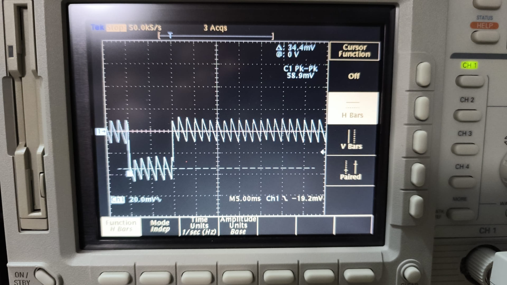
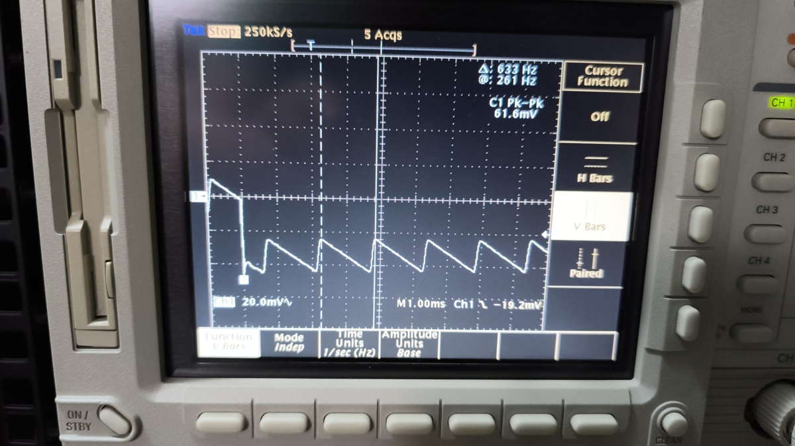
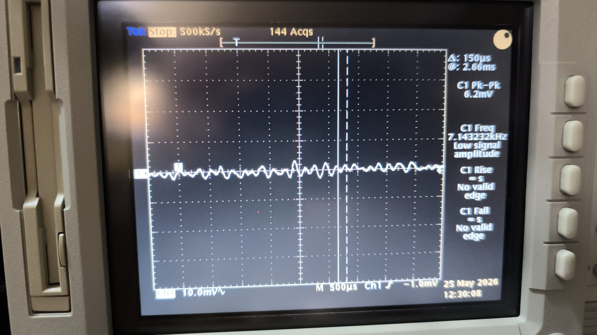
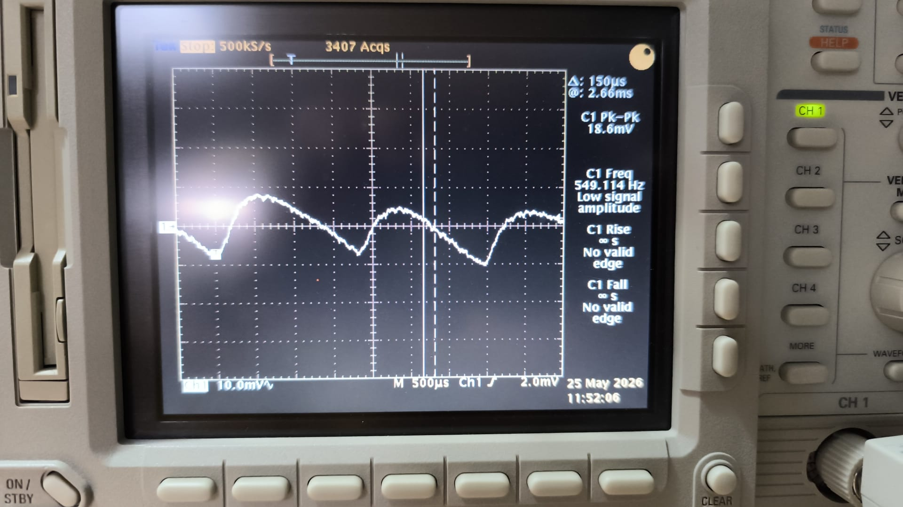
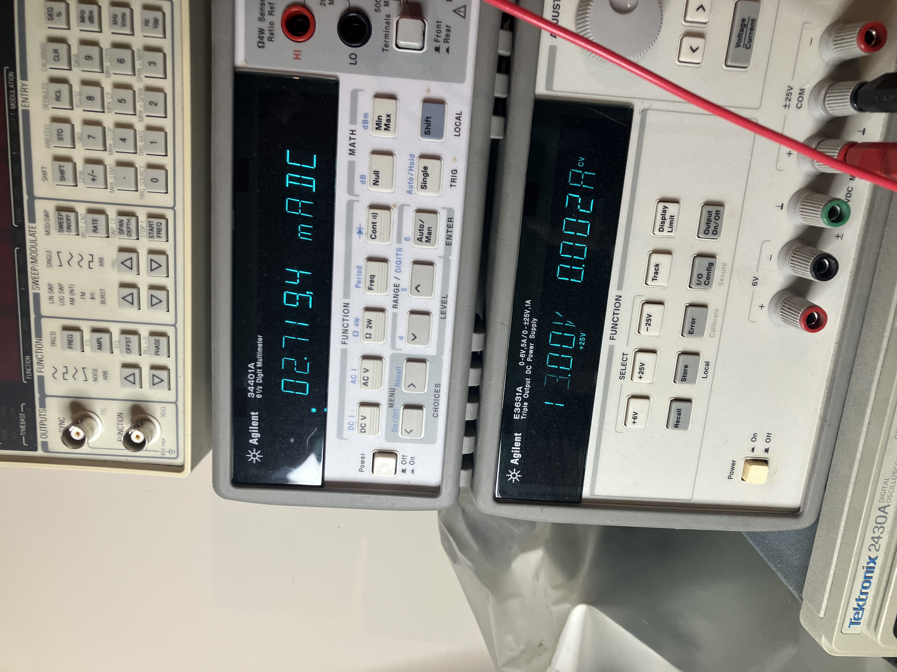

# M9OMS VLDO V2 — Quiescent Current vs Stability

*By M9OMS and CR7BTQ.*

Quiescent current (Iq) measurements for the VLDO V2 across an **8 V to 18 V**
input range, with three voltage-reference candidates. This page records the
stability investigation that determined the reference choice for the first V2
release, and the resulting trade-off between quiescent current and verified
stability: two of the three candidates measure favourably on a multimeter, but
only one has been verified stable on the oscilloscope.

> **Iq measurements by M9OMS**; oscillation investigation and stability
> verification by M9OMS and CR7BTQ.

---

## Background: sawtooth oscillation

Development of the V2 was delayed substantially by a sawtooth oscillation on
the output. The oscillation was traced to the voltage reference — originally an
OnSemi LP2950, selected to minimise quiescent current. The LP2950 has a
reputation for being difficult to stabilise; in this circuit, the oscillation
persisted through every stabilisation measure attempted.

*Sawtooth oscillation with the LP2950 reference. 20 mV/div, 5 ms/div;
cursor measurement 633 Hz.*

*The same oscillation on a 1 ms/div timebase.*

Loading the reference output with a 10 kΩ resistor reduced the oscillation
amplitude by approximately two thirds, but raised its frequency from 633 Hz to
approximately 7 kHz. This was not considered acceptable.

*LP2950 loaded with 10 kΩ: amplitude reduced by approximately two thirds,
frequency raised to approximately 7 kHz.*

CR7BTQ suspected that, as a consequence of the topology, a small current — of
the order of microamps — flows from the LTP (long-tailed pair) back into the
reference. The LP2950 was subsequently tried in a V1.1 board with the same
result: a slower oscillation, consistent with the slower response of this
regulator.

*LP2950 in a V1.1 board: the same behaviour at a lower frequency.*

---

## Reference substitution: 78L05

A stable V1 prototype had previously been verified by KC7XE. On that basis,
M9OMS proposed substituting a 78L05. Although not a conventional voltage
reference, as a regulator it can be expected to have *some* current-sinking
capability — although no documentation has been found that specifies this. It
is also a long-established part with a record of stable operation, and its
output is quieter (see the
[transient response measurements](transient.html)).

With the 78L05 fitted, the 20 mV sawtooth was eliminated, leaving
approximately 2 mV of ripple and no residual oscillation. The higher quiescent
current of the 78L05 was accepted in exchange for verified stability, and this
is the configuration of the first V2 release.

---

## V2.1: next steps

V2.1 development is underway with a different reference: a precision voltage
reference specified to sink up to 10 mA. This candidate requires thorough
testing, and dynamic characterisation is some weeks away.

---

## Quiescent current measurements

Measured quiescent current for the VLDO V2 with each of the three reference
candidates, across the 8 V to 18 V input range.

> **Measured by M9OMS.** Power supply: Agilent E3631A; Iq measured on an
> Agilent 34401A 6½-digit multimeter.

*Iq measurement setup: Agilent E3631A power supply and Agilent 34401A
6½-digit multimeter.*

### LP2950 reference — **unstable**

| Input voltage | Measured Iq |
|---------------|-------------|
| 8 V           | 1.13 mA     |
| 9 V           | 1.25 mA     |
| 10 V          | 1.38 mA     |
| 11 V          | 1.51 mA     |
| 12 V          | 1.85 mA     |
| 13 V          | 1.96 mA     |
| 14 V          | 2.07 mA     |
| 15 V          | 2.17 mA     |
| 16 V          | 2.27 mA     |
| 17 V          | 2.38 mA     |
| 18 V          | 2.48 mA     |

### ST 78L05ACZ reference — **stable** ([transient measurements](transient.html))

| Input voltage | Measured Iq |
|---------------|-------------|
| 8 V           | 4.54 mA     |
| 9 V           | 4.69 mA     |
| 10 V          | 4.83 mA     |
| 11 V          | 4.97 mA     |
| 12 V          | 5.28 mA     |
| 13 V          | 5.45 mA     |
| 14 V          | 5.56 mA     |
| 15 V          | 5.67 mA     |
| 16 V          | 5.77 mA     |
| 17 V          | 5.89 mA     |
| 18 V          | 5.99 mA     |

### V2.1 with new Vref — **stability not yet verified**

| Input voltage | Measured Iq |
|---------------|-------------|
| 8 V           | 1.88 mA     |
| 9 V           | 2.00 mA     |
| 10 V          | 2.13 mA     |
| 11 V          | 2.26 mA     |
| 12 V          | 2.52 mA     |
| 13 V          | 2.72 mA     |
| 14 V          | 2.83 mA     |
| 15 V          | 2.93 mA     |
| 16 V          | 3.03 mA     |
| 17 V          | 3.16 mA     |
| 18 V          | 3.25 mA     |

---

## Summary

The lowest-Iq candidate sustained a sawtooth oscillation that multimeter
measurement alone would not have revealed. The first release of V2 therefore
uses a non-traditional reference with a higher quiescent current and verified
stability, and oscilloscope verification is treated as an essential step for
any future reference candidate.

---

*Iq measurements: **M9OMS**, Agilent E3631A supply, Agilent 34401A 6½-digit
multimeter, 8 V–18 V input. Stability verification by oscilloscope: **CR7BTQ**, see the
[transient response measurements](transient.html). See the
[project README](README.md) for design rationale and the full specification
table.*
