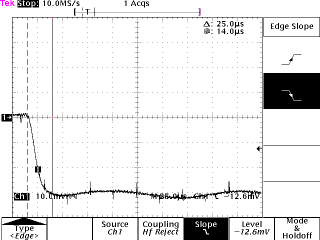
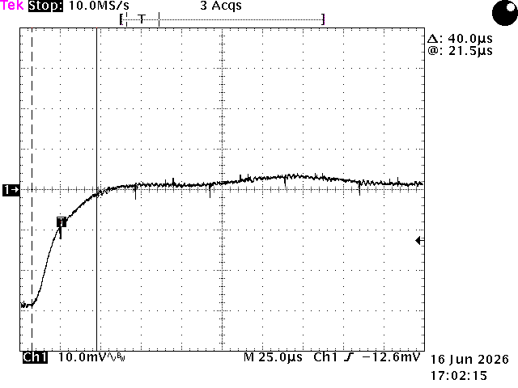

# M9OMS VLDO V2 — Transient Response (Load-Step Measurements)

Oscilloscope captures of the VLDO V2 output during load steps between **0.1 A and
1.5 A**, at the **12 V setting** with a **13.8 V input**. This page records the
measurements behind the load-step rows of the
[specification table](design.md#electrical-specifications). It supplements the
[DC and thermal bench measurements](measurements.md); loop characterisation
(phase margin, gain margin, unity-gain bandwidth), PSRR and broadband noise are 
not addressed here.

> **Measurements by CR7BTQ** (June 2026), on a single production-representative
> V2 board, 12 V jumper setting.

**Product page:** [M9OMS VLDO V2 — RF-quiet power supply for QRP Labs QMX](index.md)

---

## Test setup and conditions

- **Board:** production-representative V2, 12 V jumper setting.
- **Input:** 13.800 V DC, maintained at the PCB input pads by a four-terminal
  connection to the power supply, compensating for voltage drop in the
  supply leads.
- **Load:** electronic load pulsing between 0.1 A and 1.5 A. The edge rate of the
  load transition was **not characterised**; settling figures are representative
  of this setup rather than a specification against a defined load slew rate.
- **Measurement point:** directly at the PCB output pads.
- **Oscilloscope:** Tektronix TDS 784D, 10 MS/s sample rate, 25 µs/div timebase,
  Ch1 at 10 mV/div, AC-coupled, 20 MHz bandwidth limit enabled.
- **Probes:** Tektronix P6139A, 500 MHz bandwidth.
- **Trigger:** Ch1 edge at −12.6 mV, HF Reject trigger coupling.
- **Captures:** single-shot acquisitions; times measured with on-screen cursors.

---

## Load applied: 0.1 A → 1.5 A

*0.1 A → 1.5 A load step, 12 V setting, 13.8 V in. AC-coupled, 10 mV/div,
25 µs/div. Cursors: 25.0 µs.*

When the load is applied, the output dips by roughly ~30 mV to within the 
measurement noise floor in approximately **25 µs** by cursor measurement.

---

## Load released: 1.5 A → 0.1 A

*1.5 A → 0.1 A load step, 12 V setting, 13.8 V in. AC-coupled, 10 mV/div,
25 µs/div. Cursors: 40.0 µs.*

When the load is released, the output recovers upward by a similar ~30 mV,
settling to within the measurement noise floor in approximately **40 µs** by
cursor measurement.

---

## Observations

- **Settling:** approximately 25 µs (load applied) and 40 µs (load released) to
  within the measurement noise floor, measured by cursor on single captures.
- **Damping:** recovery is well damped in both directions; no ringing was observed.
- **Overshoot:** no overshoot or undershoot beyond the ~0.5 mV noise floor of the
  measurement was observed at this resolution (10 mV/div).

---

## Measurement limitations

Read the captures with the following in mind:

- **AC coupling.** The channel is AC-coupled, so the captures show the transient
  excursion and recovery but **not** the static load-regulation shift between the
  0.1 A and 1.5 A operating points. For that figure see the
  [DC bench measurements](measurements.md). AC coupling is also a practical
  necessity here: no commonly available oscilloscope has the vertical resolution
  to resolve millivolt-level detail superimposed on a 12 V DC level, so the DC
  component must be removed to observe the transient at this sensitivity.
- **Settling-time criterion.** The settling times were read subjectively from the
  waveform, as the point beyond which the trace no longer visibly approaches its
  final value, rather than by the standard 10 %–90 % rise/fall-time convention
  used for digital circuits. This criterion was chosen deliberately: it better
  reflects the time between the load change and the output reaching its final
  voltage, at the cost of the repeatability of the standard method. The criterion
  may be refined in future measurements.
- **Noise floor.** The settled trace shows a band of ~0.5 mV p-p, which includes
  probe and ground-loop pickup at this sensitivity. This is an upper bound on what
  the setup can resolve — **these captures are not a ripple measurement although
  ~2 mV p-p is observed**, and the timebase and sample rate here are chosen for the
  transient, not for characterising high-frequency content.
- **Coupled spikes.** Narrow, periodic, alternating-polarity spikes visible on
  both captures are switching-edge pickup coupled into the probe ground loop —
  an artefact of measuring at a very sensitive vertical scale (10 mV/div) in a
  laboratory with other equipment operating, and routinely observed on digital
  oscilloscopes at their most sensitive settings. They are present independent
  of the load-step event and are not attributed to the regulator.
- **Single captures, single board.** Both traces are single-shot acquisitions on
  one board at one output setting; treat the figures as representative rather
  than guaranteed limits.

---

## Relationship to the specification table

These captures are the source of the following rows in the
[specification table](design.md#electrical-specifications):

- **Load-step overshoot / undershoot** — none observed beyond the measurement
  noise floor.
- **Load-step settling time** — ~25 µs (load applied), ~40 µs (load released).

Loop characterisation, PSRR and output-noise measurements remain outstanding, as
noted under [Validation Status](design.md#validation-status).

---

*Transient measurements: **CR7BTQ**, June 2026, single V2 sample, 12 V
setting, 13.8 V input, electronic load 0.1 A ↔ 1.5 A. See the
[project README](design.md) for design rationale and the full specification
table.*
