# M9OMS VLDO V2 — Oscilloscope Measurements (Noise Floor, Load Steps, Power-On and Power-Off)

Oscilloscope captures of the M9OMS VLDO V2 - **NEW V2.1 board revision**, under a
**13.8 V input**, covering the measurement noise floor, the voltage reference,
output voltage at constant loads from **0 mA to 2 A**, transient response to load
steps between **0.1 A and 1.5 A**, and power-on and power-off ramps. This page
records the measurements behind the corresponding rows of the
[specification table](design.md#electrical-specifications). It supplements the
[DC and thermal bench measurements](measurements.md); loop characterisation
(phase margin, gain margin, unity-gain bandwidth), PSRR and broadband noise are
not addressed here.

> **Measurements by CR7BTQ** (August 2026), on a single V2.1 board.

**Product page:** [M9OMS VLDO V2 — RF-quiet power supply for QRP Labs QMX](index.md)

---

## Test setup and conditions

- **Board:** production-representative V2.1 board - 12 V or 9 V jumper setting.
- **Input:** 13.800 V DC, maintained at the PCB input pads by a four-terminal
  connection to the power supply (Agilent 66309D). An additional supply (Tenma 72-2540) was used for some tests.
- **Load:** electronic load pulsing between 0.1 A and 1.5 A. The edge rate of the
  load transition was **not characterised**; settling figures are representative
  of this setup rather than a specification against a defined load slew rate.
- **Measurement point:** directly at the PCB output pads.
- **Oscilloscope:** Tektronix TDS 784D; sample rate and timebase are labelled on
  the individual captures.
- **Bandwidth limit:** 20 MHz, enabled for every capture on this page, to reject
  external noise picked up by the probes. See
  [Measurement noise floor](#1-measurement-noise-floor) below.
- **Probes:** Tektronix P6139A, 500 MHz bandwidth.
- **Channels:** Ch1 is the regulator output throughout, except where stated. For
  the power-on and power-off captures, Ch2 is the input.
- **Power switching:** power was applied and removed using the bench supply's
  output On/Off button, not by interrupting the supply leads.
- **Vertical scale and coupling:** the reference, constant-load and load-step
  captures are AC-coupled at 10.0 mV/div. The power-on and power-off captures are
  DC-coupled at 2.00 V/div on both channels.
- **Trigger:** was not held constant, to obtain the clearest captures.

---

## 1. Measurement noise floor

Before measuring the regulator, the probe was measured against ground to
establish what the setup itself contributes. All measurements on this page are
read against this floor.

### TEK00027 — Ground reference, no bandwidth limit

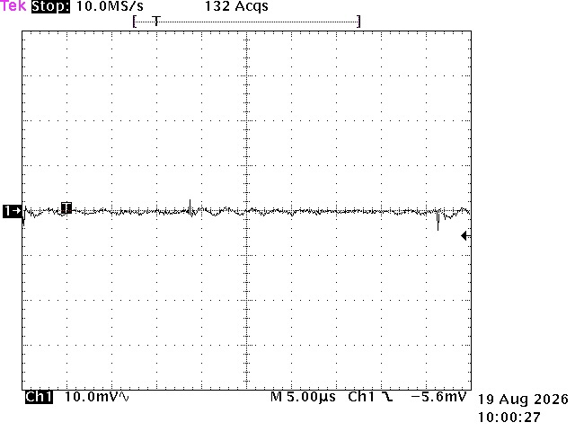

Without a bandwidth limit the trace shows a continuous band of noise with
occasional narrow spikes — all of it picked up by the probes rather than
originating in the regulator. Part of it was traced to a magnifier lamp at the
bench; a component at around **80 MHz** was also present, most likely computers running in the same room. The remainder was not identified.

### TEK00028 — Ground reference, 20 MHz bandwidth limit

With the 20 MHz bandwidth limit enabled the externally coupled content is largely
removed and the trace collapses to a thin band. **Every capture on this page was
taken with this limit enabled.**

The two captures differ in timebase to obtain a clear capture of the noise floor.

---

## 2. Voltage reference

### TEK00029 — REF5050 output

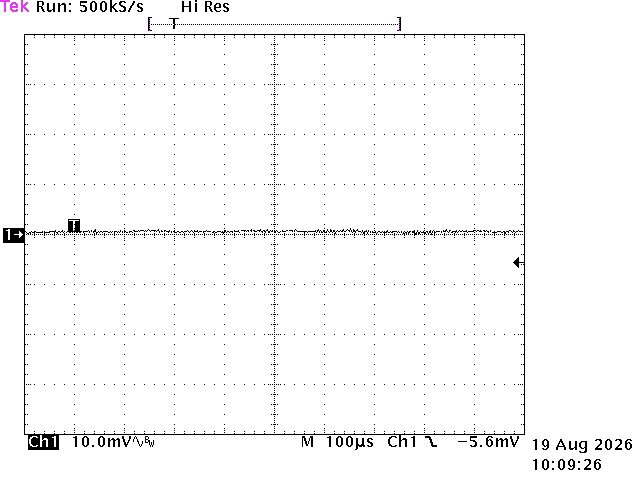

The reference trace is indistinguishable from the ground-reference capture above:
no periodic content and no structure above the measurement floor at this
sensitivity. The REF5050 measures **4.995 V**; this capture is AC-coupled at
10.0 mV/div and so shows the noise on the reference rather than its absolute
value, and the 4.995 V figure is from a separate DC measurement.

---

## 3. Output voltage at constant load

Output voltage captured at six constant load currents from no load to 2 A.

### TEK00030 — 0 mA constant load

### TEK00031 — 100 mA constant load

### TEK00032 — 500 mA constant load

### TEK00033 — 1 A constant load

### TEK00034 — 1.5 A constant load

### TEK00035 — 2 A constant load

Across the full 20:1 load range, no trace departs meaningfully from the
measurement noise floor established in section 1, and there is no progressive
worsening as load increases. Each capture covers 50 ms, and none shows periodic
content, drift or any repeating disturbance.

What this demonstrates is the absence of low-frequency instability: no load-dependent oscillation, and no marginal behaviour appearing
at any point between no load and the 2 A rating. What it does **not** provide is
a ripple or noise figure. These captures suggest (rather than measure) lower ripple
than the original V2 board. A dedicated ripple measurement remains outstanding.

Any noise visible on the loaded traces is an artefact of the electronic
load rather than of the regulator. This was confirmed by repeating the
measurements with resistive loads (noise was significantly reduced); the electronic
load was present for all captures that follow (with the load set to "off" where no load was necessary).

---

## 4. Transient response

### TEK00036 — 0.1 A → 1.5 A, load applied

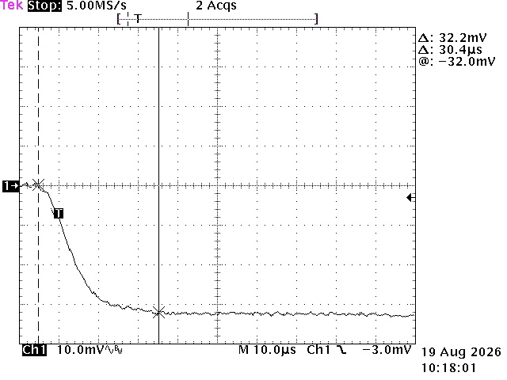

When the load is applied, the output falls by **32 mV**, reaching its final value
in approximately **30 µs**. There is no
excursion beyond the final value, and no ringing.

### TEK00037 — 1.5 A → 0.1 A, load released

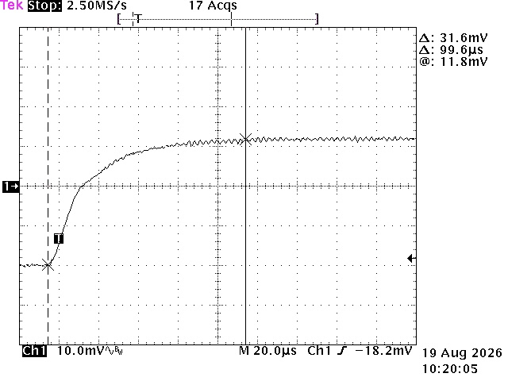

When the load is released, the output rises by the same **32 mV**, reaching its
final value in approximately **100 µs**. The recovery is a clean with no overshoot.

Settling is slower on release than on application.

For context, both figures are three orders of magnitude shorter than a CW element
at 20 WPM.

---

## 5. Power-on, 12 V setting

Output (Ch1) and input (Ch2) captured as power is applied, at six constant load
currents.

### TEK00038 — 0 mA constant load

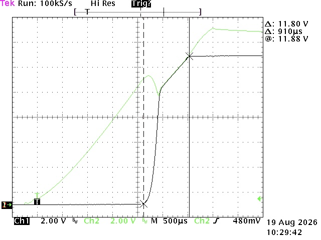

### TEK00039 — 100 mA constant load

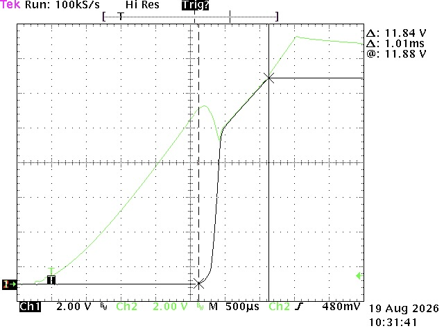

### TEK00040 — 500 mA constant load

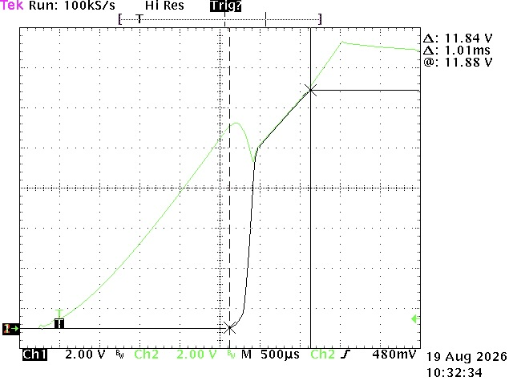

### TEK00041 — 1 A constant load

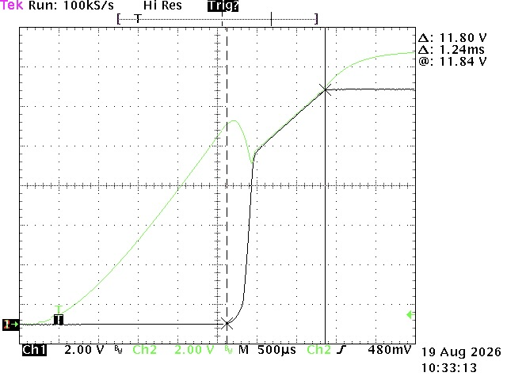

### TEK00042 — 1.5 A constant load

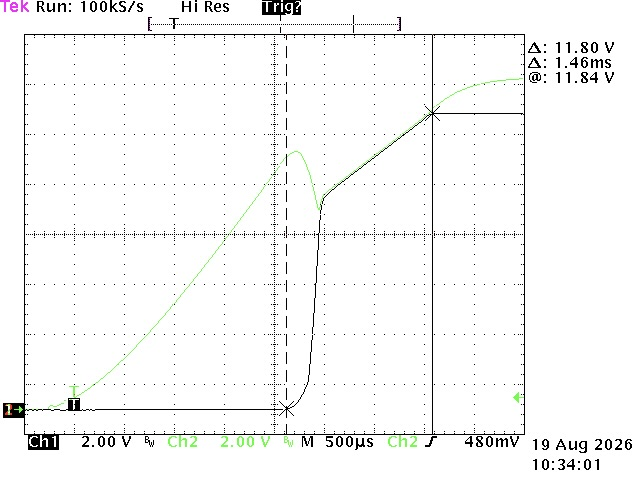

### TEK00043 — 2 A constant load

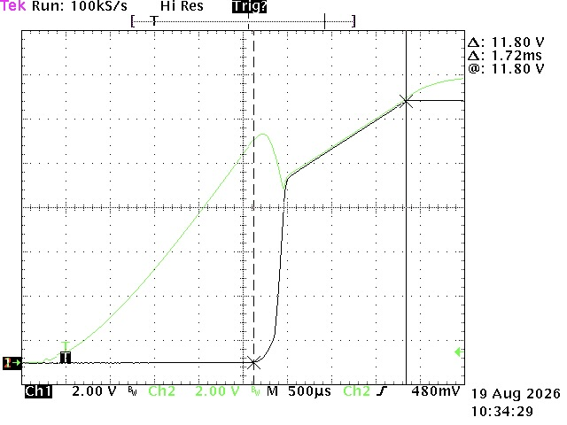

The output behaves identically at every load: flat at zero while the input ramps,
then a single steep, monotonic rise, then a soft knee onto the settled level.
**No overshoot at any load**, no steps, no retriggering and no disturbance on the
knee.

---

## 6. Power-off, 12 V setting

Output (Ch1) and input (Ch2) captured as power is removed, at five constant load
currents. No cursors were set on these captures, so the figures below are
qualitative.

### TEK00044 — 100 mA constant load

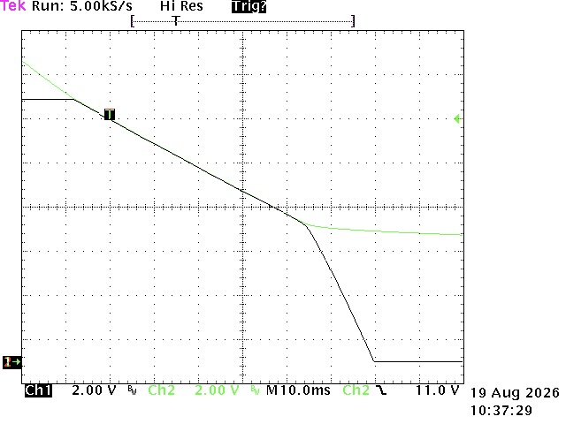

### TEK00045 — 500 mA constant load

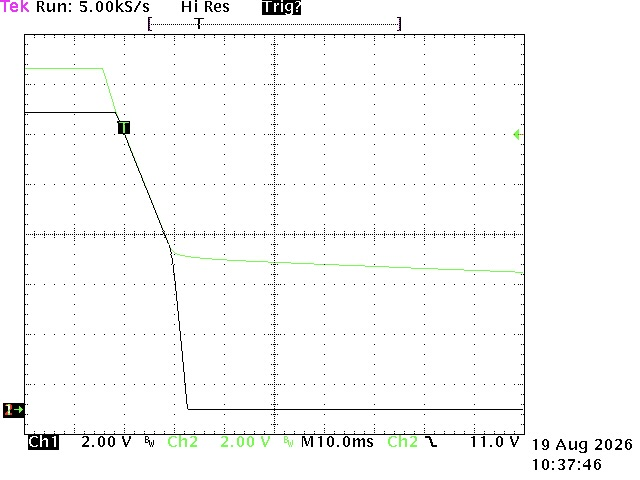

### TEK00046 — 1 A constant load

### TEK00047 — 1.5 A constant load

### TEK00048 — 2 A constant load

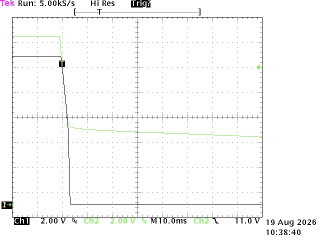

The output falls with the input in every case, riding just below it by the
dropout voltage until the input can no longer sustain the setpoint, at which
point the output falls away to zero. The collapse is clean at every current: no
oscillation, no ringing, no partial recovery.

The series differs only in timing, and systematically so. At 100 mA the decline
is gradual and occupies most of the 100 ms window; by 2 A the collapse arrives
shortly after the input is removed. This is the load discharging the supply's
reservoir at proportionally higher current, not a change in the regulator's
behaviour. No 0 mA capture was taken: with no load the output remains present for
several seconds after power is removed.

---

## 7. Power-on, 9 V setting

Behaviour at the 9 V setting (constant load, transient response), did not show any difference to the 12 V setting, apart from the observations in this section:

### TEK00050 — Input threshold at the 9 V setting

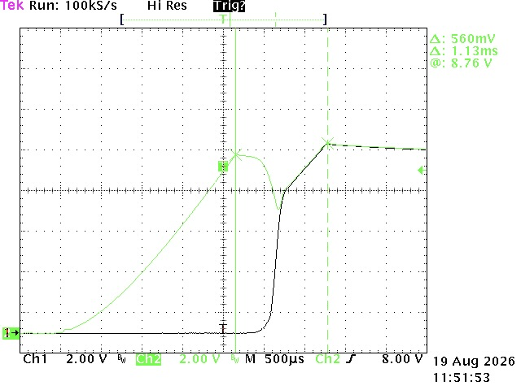

The Ch2 cursors put the input at **8.76 V** where the output capacitor begins
charging, which appears to be the limiting factor on this capture. The same input
dip seen at the 12 V setting is present here. In practice the circuit starts up
correctly from an input as low as **6.5 V** at the 9 V setting.

### TEK00051 — Startup behaviour at the 9 V setting

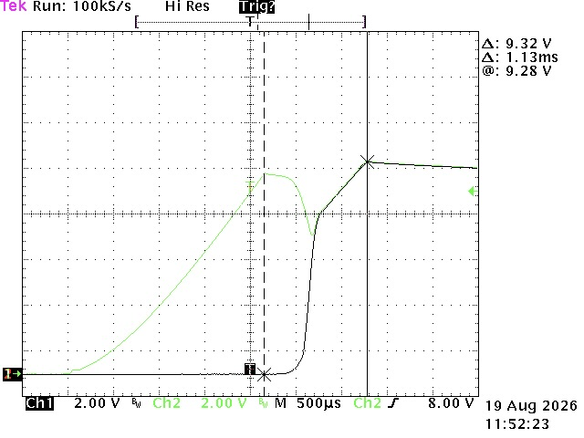

Fully damped regulation settling with only a slight rise above the target voltage. The output rises to a peak and then declines gently to its settled value across the remainder of the frame. Well-damped and no ringing follows it.

The oscilloscope reads **9.28 V** at the peak. The peak has not been
established with a more accurate instrument and no exact value is claimed here.

---

## Observations

- **Reference:** REF5050 output measures 4.995 V, with no noise measurable.
- **Constant load:** no departure from the noise floor at any load from 0 mA to
  2 A, and no periodic content; no low-frequency instability at any point in the
  operating range.
- **Settling:** approximately 30 µs (load applied) and 100 µs (load released) to
  within the measurement noise floor, measured by cursor on single captures.
- **Damping:** recovery is well damped in both directions; no ringing was observed.
- **Overshoot:** during load step measurements, no overshoot or undershoot beyond
  the noise floor of the measurement was observed at the resolution used.
- **Asymmetry:** recovery is slower on load release than on load application.
- **Power-on, 12 V:** no overshoot at any load from 0 mA to 2 A.
- **Power-on at 9 V:** the output capacitor begins charging at 8.76 V input on the
  captured ramp, while the circuit itself starts correctly from 6.5 V in. Fully damped regulation settling with only a slight, temporary rise above the target voltage.
- **Power-off:** output tracks the input down under load until it collapses below
  dropout, cleanly and without oscillation at every load; the collapse arrives
  sooner at higher currents because the load discharges the supply reservoir
  faster. Unloaded, the output persists for several seconds.
- **Power-on interval:** the cursor interval from trigger to settled output grows
  with load — 910 µs at 0 mA, 1.01 ms at 100 mA and 500 mA, 1.24 ms at 1 A,
  1.46 ms at 1.5 A and 1.72 ms at 2 A. This is dominated by the input ramp and is
  not a regulator start-up figure; see the limitations below.
- **Settled output at 2.00 V/div:** the power-on cursors read 11.88 V at 0 mA to
  500 mA, 11.84 V at 1 A and 1.5 A, and 11.80 V at 2 A. At this vertical scale
  the readings are coarse - the instrument is not being used to measure load-regulation.

---

## Measurement limitations

Read the captures with the following in mind:

- **AC coupling.** For the load-step captures the channel is AC-coupled - those
  captures were taken to show transient excursion and recovery but **not** the static
  load-regulation shift between the
  0.1 A and 1.5 A operating points. For that figure see the
  [DC bench measurements](measurements.md).
  AC coupling is also a practical necessity here: no commonly available
  oscilloscope has the vertical resolution to resolve millivolt-level detail
  superimposed on a 12 V DC level, so the DC component must be removed to observe
  the transient at this sensitivity. The power-on and power-off captures show the
  absolute output and input voltages as they ramp, and are therefore not
  AC-coupled; the sensitivity argument above does not apply to them.
- **Settling-time criterion.** The settling times were read subjectively from the
  waveform, as the point beyond which the trace no longer visibly approaches its
  final value, rather than by the standard 10 %–90 % rise/fall-time convention
  used for digital circuits. This criterion was chosen deliberately: it better
  reflects the time between the load change and the output reaching its final
  voltage, at the cost of appearing to take longer. It also depends on how far
  into the noise the trace can be followed: the quieter settled band on the V2.1
  revision extends the visible tail, placing the cursor later than the previous ~2 mV p-p
  band (V2) allowed. The effect is largest on release, where the final approach
  is asymptotic. **The figures on this page are therefore not directly comparable, and the longer
  V2.1 figures do not indicate slower recovery than the V2.0 board.**
- **Noise floor.** The settled trace shows a band of noise, which includes probe
  and ground-loop pickup and, on the captures taken with the load connected,
  artefacts from the electronic load at this sensitivity. The ground-reference
  captures in section 1 show the same setup measured against ground, without the
  electronic load contributing; repeating the constant-load captures with
  resistive loads removes the noise, confirming its origin.
  This is an upper bound on what the setup can resolve — **these captures are not
  a ripple measurement although no ripple is observed** — and the timebase and
  sample rate here are chosen for the transient, not for characterising
  high-frequency content.
- **Input ramp rate.** The input does not rise instantaneously when the supply
  output is switched on. The ramp is shaped by the supply's current limiting and
  internal electronics, by cable inductance, and by other factors not isolated
  here; the load-dependent dip visible on Ch2 in section 5 is part of the same
  effect. **No accurate figure for regulator start-up time can be taken from
  these captures**, since the input transition itself dominates.
- **Oscilloscope voltage accuracy.** As noted for the 9 V overshoot above - absolute voltages read
  from these captures should be treated as approximate.
- **Single captures, single board.** Each trace is one capture on one board;
  treat the figures as representative rather than guaranteed limits.

---

## Relationship to the specification table

These captures are the source of the following rows in the
[specification table](design.md#electrical-specifications):

- **Load-step overshoot / undershoot** — none observed beyond the measurement
  noise floor.
- **Load-step settling time** — ~30 µs (load applied), ~100 µs (load released).

Loop characterisation, PSRR and output-noise measurements remain outstanding, as
noted under [Validation Status](design.md#validation-status).

---

*Oscilloscope measurements: **CR7BTQ**, August 2026. See the [project README](design.md) for design
rationale and the full specification table.*
