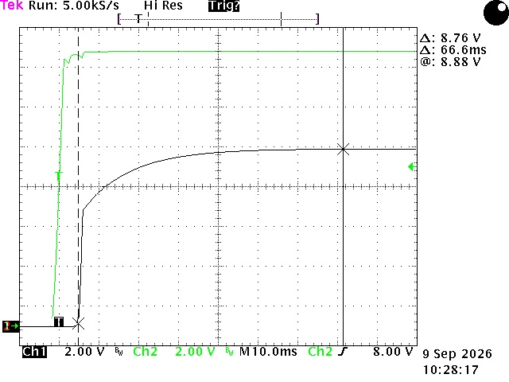
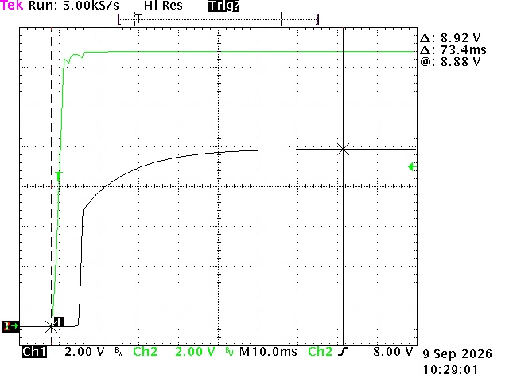
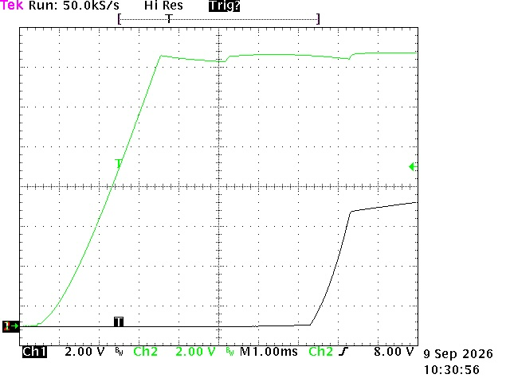
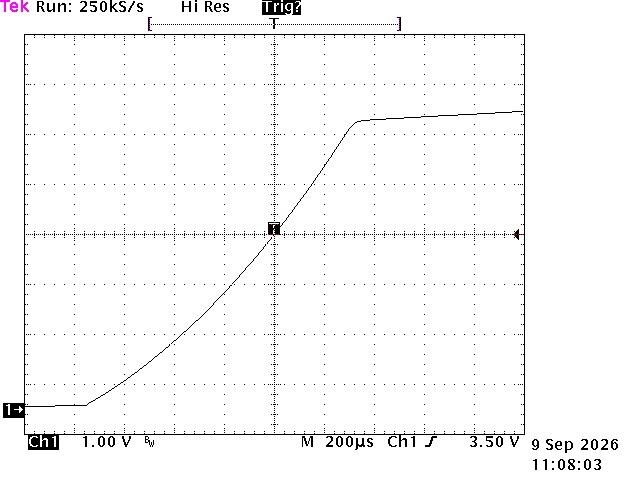
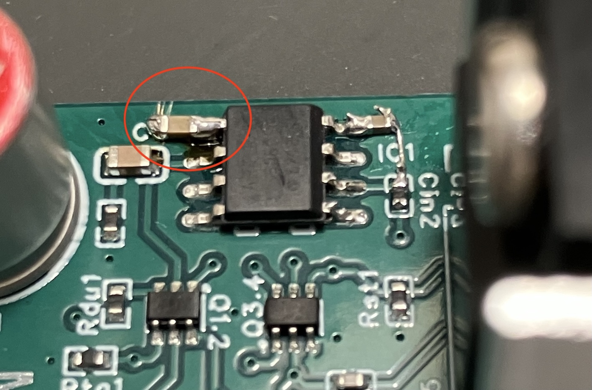
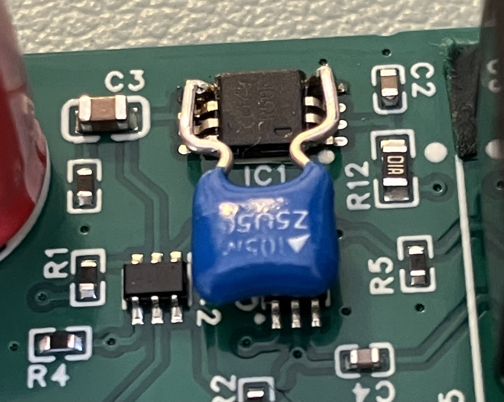

# M9OMS VLDO V2.1 — Optional Upgrade

An optional modification to the V2.1 board, for builders who wish to implement it. A
**1 µF capacitor** is added between **pin 5 of the voltage reference and ground**,
which resolves the slight rise above target at the 9 V setting 
[as seen on the previous page](transient.md#7-power-on-9-v-setting): The result a small increase in startup time, with **no adverse effect on
safety or operation**. This page records the captures, verifying the addition of this capacitor.

> **Measurements by CR7BTQ** (September 2026), on a single V2.1 board.

**Product page:** [M9OMS VLDO V2 — RF-quiet power supply for QRP Labs QMX](index.md)

---

## Test setup and conditions

The setup is identical to that used for the
[oscilloscope measurements](transient.md#test-setup-and-conditions). The only
variable is the addition of the 1 µF capacitor between pin 5 of the voltage
reference and ground. The captures in sections 1 and 2 were taken at the **9 V**
jumper setting.

---

## 1. Startup timing

### TEK00053 — Output rise to settled value

From the first movement of the output until it sits very close to its final
value, the cursor interval is **66.6 ms**, with the settled output read at
**8.88 V**.

### TEK00054 — Input applied to settled output

Measured from the point at which the input is applied, the interval is
**73.4 ms**. This figure includes the input transition and will therefore vary
with the rate of rise on the input.

---

## 2. The output rise

### TEK00055 — Output rise, 1.00 ms/div

### TEK00056 — Output rise, 200 µs/div

At these timebases the rise is smooth and controlled throughout. The output
reaches approximately **6 V** in roughly **1 ms**.

---

## 3. 12 V setting

The 12 V setting was observed on the oscilloscope but not captured. It follows the
9 V setting, the shape of the ramp being consistent across output voltages. The
output rises quickly to around **two-thirds** of the final output voltage, then
more slowly until it reaches the final value, in a way that resembles a
logarithmic curve.

---

## 4. How to implement this

Either method is acceptable; choose whichever suits your ability.

### Option 1 — SMD capacitor to pin 5 and board ground

Remove a small area of solder mask to expose board ground, then place and solder
the 1 µF capacitor between pin 5 of the voltage reference and that point. The
photograph above was taken on a prototype board.

### Option 2 — THT capacitor between pin 5 and the reference ground pin

Solder a through-hole capacitor directly between pin 5 of the voltage reference
and its ground pin. The photograph above was taken on a final production board.

**Take care not to bridge pin 5 to any of the neighbouring pins on the voltage
reference — the pitch is fine.**

---

*Oscilloscope measurements: **CR7BTQ**, September 2026. See the
[project README](design.md) for design rationale and the full specification table.*
